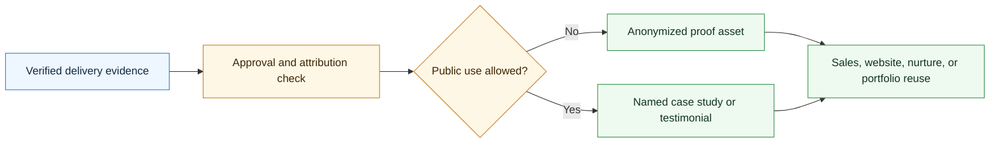

# Agentic Case Study Skill

<p align="center">
  
</p>

A CompleteTech LLC Codex skill for creating case studies, testimonials, and proof assets after agentic development delivery.

## About

Part of the CompleteTech LLC agentic services skill library. This skill packages verified delivery outcomes into approved proof assets while preserving confidentiality, attribution boundaries, and brand consistency.

## OpenClaw / ClawHub Metadata

- Skill key: `agentic-case-study-skill`
- Version-ready metadata: `1.0.0`
- Homepage: https://github.com/CompleteTech-LLC/agentic-case-study-skill
- README: https://github.com/CompleteTech-LLC/agentic-case-study-skill#readme
- Runtime binaries: `python3`
- Python packages: none
- Intended registry/discovery tags: `latest`, `complete-tech`, `codex-skill`, `agentic-development`, `agentic-workflows`, `case-study`, `testimonials`, `proof-assets`
- License: repository code, templates, and documentation use MIT; ClawHub publishing is intentionally skipped for now.
- Brand assets: CompleteTech LLC names, logos, seals, and brand assets are reserved; see `BRAND_ASSETS.md`.

## Workflow Diagram



## What It Does

- Selects the right proof artifact by evidence, approval status, and channel.
- Drafts case study intake, client interviews, anonymized/named case studies, before/after summaries, implementation stories, technical notes, risk/control summaries, testimonials, proof libraries, sales one-pagers, website case studies, LinkedIn posts, nurture stories, referral blurbs, portfolio entries, pitches, award submissions, press releases, and approval checklists.
- Helps turn delivered agentic workflow projects into credible sales and marketing assets without inventing proof or exposing sensitive details.
- Keeps proof aligned with practical CompleteTech LLC positioning: bounded agentic workflow implementation, human approval gates, evaluation, monitoring, documentation, support, and handoff.

## Contents

- `SKILL.md` - operating instructions and proof-asset selection guide.
- `references/proof-catalog.md` - reusable case study/testimonial/proof templates.
- `references/use-case-decision-table.md` - quick guide for choosing the right artifact.
- `references/proof-lifecycle.md` - flow from proof intake through approval and reuse.
- `references/proof-positioning.md` - CompleteTech LLC evidence and anonymization guardrails.
- `scripts/render_proof.py` - deterministic template listing and rendering helper.

## Quick Start

```bash
python3 scripts/render_proof.py --list
python3 scripts/render_proof.py \
  --template anonymized-case-study \
  --var workflow="support triage" \
  --var before_state="manual queue review" \
  --var after_state="reviewed agent workflow with approval gates"
```

Rendered assets are drafts. Replace placeholders with verified, client-approved facts before public or external use.

## Example


Preview converted from generated artifact: [example.md](assets/examples/example.md).

**Anonymized case study: Support Queue Stabilization**

Use this when delivery evidence is real, but public attribution is not approved yet.

```bash
python3 scripts/render_proof.py \
  --template anonymized-case-study \
  --var client_name="Confidential B2B SaaS Company" \
  --var workflow="support intake and triage" \
  --var before_state="tickets were manually sorted across three queues with inconsistent escalation notes" \
  --var after_state="a reviewed agentic triage workflow drafts classifications, escalation notes, and next-step summaries for human approval" \
  --var approval_status="anonymized internal and sales-use only" \
  > assets/examples/example.md
```

Example positioning:

> CompleteTech LLC helped a growing SaaS support team turn a high-friction triage queue into a reviewed workflow where suggested classifications, escalation notes, and customer-ready summaries are prepared consistently before a human approves any external response.

## Brand Notes

Use careful evidence packaging. Distinguish measured outcomes from qualitative observations, protect confidential details, anonymize when needed, avoid regulated-use assurances, avoid legal claims, avoid fabricated ROI/savings metrics, and preserve the CompleteTech LLC emphasis on bounded implementation, human approval gates, evaluation, monitoring, documentation, support, and handoff.

## License

Code, templates, and documentation are licensed under the MIT License. CompleteTech LLC names, logos, seals, and brand assets are reserved and are not licensed for reuse except to identify this project. See `LICENSE` and `BRAND_ASSETS.md`.
