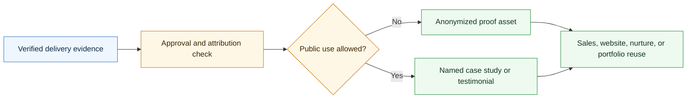

# Agentic Case Study Skill

A CompleteTech LLC Codex skill for creating case studies, testimonials, and proof assets after agentic development delivery.

## Workflow Diagram



## What It Does

- Selects the right proof artifact by evidence, approval status, and channel.
- Drafts case study intake, client interviews, anonymized/named case studies, before/after summaries, implementation stories, technical notes, risk/control summaries, testimonials, proof libraries, sales one-pagers, website case studies, LinkedIn posts, nurture stories, referral blurbs, portfolio entries, pitches, award submissions, press releases, and approval checklists.
- Helps turn delivered agentic workflow projects into credible sales and marketing assets without inventing proof or exposing sensitive details.
- Keeps proof aligned with practical CompleteTech LLC positioning: bounded agentic workflow implementation, human approval gates, evaluation, monitoring, documentation, support, and handoff.

## Contents

- `SKILL.md` - operating instructions and proof-asset selection guide.
- `references/proof-catalog.md` - reusable case study/testimonial/proof templates.
- `references/use-case-decision-table.md` - quick guide for choosing the right artifact.
- `references/proof-lifecycle.md` - flow from proof intake through approval and reuse.
- `references/proof-positioning.md` - CompleteTech LLC evidence and anonymization guardrails.
- `scripts/render_proof.py` - deterministic template listing and rendering helper.

## Quick Start

```bash
python3 scripts/render_proof.py --list
python3 scripts/render_proof.py \
  --template anonymized-case-study \
  --var workflow="support triage" \
  --var before_state="manual queue review" \
  --var after_state="reviewed agent workflow with approval gates"
```

Rendered assets are drafts. Replace placeholders with verified, client-approved facts before public or external use.

## Brand Notes

Use careful evidence packaging. Distinguish measured outcomes from qualitative observations, protect confidential details, anonymize when needed, avoid regulated-use assurances, avoid legal claims, avoid fabricated ROI/savings metrics, and preserve the CompleteTech LLC emphasis on bounded implementation, human approval gates, evaluation, monitoring, documentation, support, and handoff.
